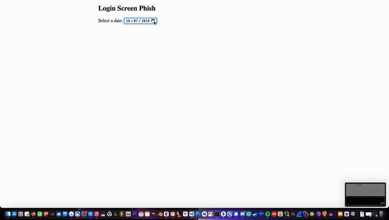

# Web-based Windows Login Screen Phishing

Modified version of https://github.com/SendToSpace/Windows-10-Login-Webpage 

#### Background Info

A maximization request has to be triggered by a user interaction, such as a javascript `click` event. I found `change` which also works and seems a bit more random.

A delay of up to 4 seconds is allowed, which makes it seem a bit more random:

